# DOMAIN_ER.md

<!--
このファイルでは、ドメインエンティティとその関係を mermaid の erDiagram 形式で記述する。

目的:
- 「このシステムの世界には何が存在し、どう関係しているか」をユーザーと合意する。
- クラス図やテーブル定義など、後続の詳細設計のベースとする。

ルール:
- 永続/非永続に関わらず「ドメインとして意味のあるエンティティ」を列挙する。
- 各エンティティの属性コメントに storage_scope を付与する (任意だが推奨):

  storage_scope 候補:
    - Ephemeral        : 1操作 / 1フレーム内だけで完結
    - Session          : セッション(ログイン中, ゲーム1プレイ中 等)の間維持
    - DeviceLocal      : デバイスローカルに永続化
    - UserPersistent   : ユーザアカウントに紐づき複数デバイス間で共有
    - GlobalPersistent : システム全体で共有される永続データ

- 関係(1:1, 1:N, N:M等)には簡潔な説明ラベルを書くとよい。
-->

```mermaid
erDiagram
  PROJECT_REPOSITORY ||--|| REQUIREMENT_ISSUE : "opens"
  PROJECT_REPOSITORY ||--o{ REQUIREMENT_DOCUMENT_SET : "contains"
  PROJECT_REPOSITORY ||--o{ MILESTONE_PLAN : "delivers through"
  PROJECT_REPOSITORY ||--o{ BOT_JOB : "triggers"
  PROJECT_REPOSITORY ||--o{ BOT_SESSION : "tracks"
  PROJECT_REPOSITORY ||--o{ IMPLEMENTATION_ISSUE : "contains"
  REQUIREMENT_ISSUE ||--o{ BOT_SESSION : "drives"
  REQUIREMENT_DOCUMENT_SET ||--o{ REQUIREMENT_PULL_REQUEST : "proposed by"
  REQUIREMENT_PULL_REQUEST ||--o{ REVIEW_CYCLE : "reviewed in"
  MILESTONE_PLAN ||--o{ IMPLEMENTATION_ISSUE : "breaks down into"
  IMPLEMENTATION_ISSUE ||--o{ IMPLEMENTATION_PULL_REQUEST : "implemented by"
  IMPLEMENTATION_PULL_REQUEST ||--o{ REVIEW_CYCLE : "reviewed in"
  BOT_SESSION ||--o{ BOT_JOB : "captures progress of"
  BOT_JOB }o--|| ROLE_PROFILE : "uses"
  BOT_JOB }o--|| PROVIDER_ADAPTER : "runs on"

  PROJECT_REPOSITORY {
    string repositoryId PK "storage_scope: GlobalPersistent / GitHub repository identifier"
    string fullName "storage_scope: GlobalPersistent / owner/name"
    string templateSource "storage_scope: GlobalPersistent / source template repository"
    string defaultBranch "storage_scope: GlobalPersistent / usually main"
  }

  REQUIREMENT_ISSUE {
    string issueId PK "storage_scope: GlobalPersistent / GitHub issue id"
    int issueNumber "storage_scope: GlobalPersistent / requirement discovery issue number"
    string status "storage_scope: GlobalPersistent / ready,in_progress,closed"
    string latestPromptSummary "storage_scope: Session / latest user intent summary"
  }

  REQUIREMENT_DOCUMENT_SET {
    string documentSetId PK "storage_scope: GlobalPersistent / docs snapshot identifier"
    string versionLabel "storage_scope: GlobalPersistent / branch or commit label"
    string requirementPath "storage_scope: GlobalPersistent / docs/REQUIREMENT.md"
    string useCasePath "storage_scope: GlobalPersistent / docs/USE_CASES.md"
  }

  REQUIREMENT_PULL_REQUEST {
    string pullRequestId PK "storage_scope: GlobalPersistent / GitHub pull request id"
    int pullRequestNumber "storage_scope: GlobalPersistent / requirement PR number"
    string status "storage_scope: GlobalPersistent / open,approved,closed"
    string reviewOutcome "storage_scope: GlobalPersistent / approved or changes_requested"
  }

  MILESTONE_PLAN {
    string milestoneId PK "storage_scope: GlobalPersistent / milestone identifier"
    string title "storage_scope: GlobalPersistent / delivery target"
    string status "storage_scope: GlobalPersistent / planned,active,completed"
    string completionCriteria "storage_scope: GlobalPersistent / manager-defined target"
  }

  IMPLEMENTATION_ISSUE {
    string implementationIssueId PK "storage_scope: GlobalPersistent / GitHub issue id"
    int issueNumber "storage_scope: GlobalPersistent / implementation issue number"
    string acceptanceCriteria "storage_scope: GlobalPersistent / definition of done"
    string status "storage_scope: GlobalPersistent / backlog,in_progress,blocked,done"
  }

  IMPLEMENTATION_PULL_REQUEST {
    string implementationPullRequestId PK "storage_scope: GlobalPersistent / GitHub pull request id"
    int pullRequestNumber "storage_scope: GlobalPersistent / implementation PR number"
    string status "storage_scope: GlobalPersistent / open,approved,merged"
    string blockerSummary "storage_scope: GlobalPersistent / present only when implementation is blocked"
  }

  REVIEW_CYCLE {
    string reviewCycleId PK "storage_scope: GlobalPersistent / review round identifier"
    string reviewerRole "storage_scope: GlobalPersistent / manager or user"
    string decision "storage_scope: GlobalPersistent / approved,changes_requested,blocked"
    string summary "storage_scope: Session / latest review summary"
  }

  BOT_SESSION {
    string sessionId PK "storage_scope: Session / issue or PR scoped session"
    string phase "storage_scope: Session / requirement,planning,implementation,review"
    string currentRole "storage_scope: Session / architect,manager,engineer"
    string openQuestions "storage_scope: Session / unresolved items"
  }

  BOT_JOB {
    string jobId PK "storage_scope: Session / execution request identifier"
    string triggerEventId "storage_scope: Session / GitHub event or workflow run id"
    string roleName "storage_scope: Session / architect,manager,engineer"
    string status "storage_scope: Session / queued,running,completed,failed"
  }

  ROLE_PROFILE {
    string roleName PK "storage_scope: GlobalPersistent / architect,manager,engineer"
    string purpose "storage_scope: GlobalPersistent / role objective"
    string promptSource "storage_scope: GlobalPersistent / profile and prompt files"
    string completionCriteria "storage_scope: GlobalPersistent / role-specific exit conditions"
  }

  PROVIDER_ADAPTER {
    string providerName PK "storage_scope: GlobalPersistent / cursor initially"
    string executionMode "storage_scope: GlobalPersistent / cli,api,stub"
    string status "storage_scope: GlobalPersistent / available,planned"
    string isolationBoundary "storage_scope: GlobalPersistent / adapter boundary description"
  }
```

